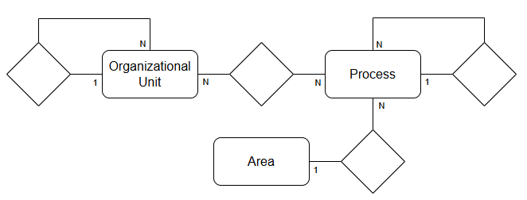

# Case Tech - Ferramenta de Mapeamento de Processos Empresariais

## Visão Geral

Empresas que crescem de forma orgânica frequentemente enfrentam dificuldades para documentar e organizar seus processos internos. A ausência de uma documentação clara dificulta a identificação dos fluxos, ferramentas utilizadas, sistemas implementados e responsabilidades, impactando a eficiência operacional e a tomada de decisões.

Esta ferramenta tem como objetivo **mapear os processos e subprocessos de uma empresa**, organizando-os por área e permitindo a gestão (Criação, Leitura, Edição e Exclusão) de:
- **Áreas:** Representam as diferentes áreas da empresa, como TI, Financeiro, etc.
- **Processos e Subprocessos:** Estruturados de forma hierárquica, permitindo o detalhamento e a organização dos fluxos de trabalho.
- **Departamentos e Setores:** Definem os responsáveis e os agrupamentos que compõem os processos.

## Arquitetura da Solução

A solução é estruturada seguindo uma arquitetura cliente-servidor em três camadas, garantindo a separação de responsabilidades, facilidade de manutenção e escalabilidade::

### 1. Camada de Apresentação (Front-End)
- **Tecnologias Utilizadas:** React com Vite e TypeScript, Axios, Sass  
- **Arquitetura:** A aplicação é estruturada em camadas/componentes, onde a interface interativa se comunica com a API REST para exibir e gerenciar os dados.
- **Funcionalidade:** Permite o cadastro, visualização e gerenciamento das áreas, processos, subprocessos e responsáveis por meio de uma interface intuitiva.

### 2. Camada de Aplicação (Back-End)
- **Tecnologias Utilizadas:** Node.js com TypeScript, Express, Prisma, Zod  
- **Arquitetura:** A lógica de negócio é organizada em modelos, repositórios, serviços e controladores, facilitando a manutenção e escalabilidade.
- **Comunicação:** Disponibiliza uma API REST que utiliza JSON para troca de dados entre o front-end e o back-end.


### 3. Camada de Dados (Banco de Dados)
- **Banco de Dados:** MySQL (gerenciado pelo Prisma)  
- **Função:** Responsável pelo armazenamento persistente dos dados. A camada de dados é acessada pelo back-end através do Prisma, garantindo integridade e segurança no acesso às informações.



### Comunicação entre Back-End e Front-End
A comunicação ocorre via **API REST**. O front-end consome os endpoints implementados no back-end por meio de requisições HTTP utilizando JSON como formato de troca de dados. Essa abordagem facilita integrações futuras e garante uma separação clara de responsabilidades.

## Funcionalidades Detalhadas 
Confira as funcionalidades e fluxos detalhados e as interações entre as entidades [aqui!](./docs/Detalhes.md)

## Estrutura do Projeto

```markdown
.
├── client/              # Front-End (React + Vite)
│   ├── public/                  
│   ├── src/
│   │   ├── assets/      
│   │   ├── components/
│   │   ├── hooks/
│   │   ├── pages/
│   │   ├── services/
│   │   ├── types/
│   │   └── utils/
│   ├── package.json
│   ├── tsconfig.json
│   ├── vite.config.ts
│   └── ...
│
└── server/              # Back-End (Node + Express)
    ├── prisma/          
    ├── src/
    │   ├── controllers/
    │   ├── models/
    │   ├── repositories/
    │   ├── routes/
    │   ├── services/    
    │   ├── utils/
    │   └── ...
    ├── package.json
    ├── tsconfig.json
    └── ...
```

*Observação: Esse é um resumo da estrutura dos diretórios. Consulte os READMEs específicos em cada pasta para mais detalhes, se necessário.*

## Decisões Técnicas

### Boas Práticas e Padrões de Design

- **SOLID:**  Foram aplicados os princípios SOLID para garantir que as classes e módulos sejam coesos, desacoplados e de fácil manutenção, facilitando a escalabilidade do sistema.

- **DRY (Don't Repeat Yourself):**  Adotei a estratégia DRY para evitar a duplicação de código, promovendo a reutilização de componentes e funções tanto no front-end quanto no back-end.

- **BEM (Block, Element, Modifier):** Utilizei a metodologia BEM para a nomeação e organização das classes CSS no front-end. Essa abordagem garante uma estrutura de estilos consistente, modular e de fácil manutenção, alinhada aos princípios de clareza e reutilização.

## Documentação da API

Para visualizar e testar os endpoints disponíveis da API REST, acesse:
 **[http://localhost:3000/api-docs](http://localhost:3000/api-docs)**

A documentação interativa foi gerada com Swagger e facilita a compreensão e uso da API por desenvolvedores e integradores.


## Instruções de Uso

Confira as instruçoes de uso para hospedar localmente o sistema [aqui!](./docs/Hospedagem.md)

## Considerações Finais

Esta documentação foi elaborada para fornecer uma visão geral e detalhada do sistema. Ela facilita o entendimento da arquitetura, das funcionalidades e das decisões técnicas adotadas. Qualquer dúvida ou sugestão de melhoria, sinta-se à vontade para entra em contato!
