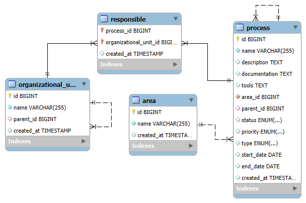

# Documentação do Sistema

Esta documentação tem o objetivo de apresentar, de maneira detalhada, como o sistema foi concebido, quais são as suas principais entidades, regras de negócio e a lógica por trás das interações entre elas. Ao final, o leitor compreenderá como cada parte se integra para garantir a consistência, a integridade e a escalabilidade do sistema.

## Visão Geral

O sistema foi projetado para gerenciar e organizar informações críticas de uma organização, dividindo-as em quatro entidades principais:
- **Áreas**: Categorias ou divisões que agrupam processos.
- **Processos**: Atividades ou fluxos que precisam ser executados e monitorados.
- **Unidades Organizacionais**: Estruturas internas que representam departamentos ou setores.
- **Responsabilidades**: Associação entre processos e unidades organizacionais, definindo quem é responsável pelo acompanhamento e execução das atividades.

A ideia central é permitir uma gestão estruturada, onde cada entidade possui regras específicas e validações que garantem a integridade dos dados e a coerência das relações entre elas.

## Detalhamento das Entidades e Lógica de Negócio

### 1. Entidade Área

#### Propósito
- **Representar uma categoria ou divisão organizacional.**  
  Cada área serve como um agrupador lógico para os processos, facilitando a organização e a consulta das atividades.

#### Regras e Validações
- **Unicidade do Nome:**  
  - Cada área deve ter um nome único, impedindo duplicidade e possíveis confusões.
  - Antes da criação, o sistema verifica se já existe uma área com o mesmo nome e, caso positivo, bloqueia a operação para evitar conflitos.

- **Validação de Existência:**  
  - Operações como consulta, atualização ou exclusão só são permitidas se a área já existir no banco de dados.
  - Se uma operação for solicitada para uma área inexistente, o sistema retorna um erro informativo, garantindo que não sejam realizadas ações inválidas.

---

### 2. Entidade Processo

#### Propósito
- **Representar atividades e fluxos de trabalho.**  
  Os processos são o núcleo operacional do sistema, representando desde tarefas simples até fluxos complexos que podem ser divididos em subprocessos.

#### Regras e Validações
- **Vinculação à Área:**  
  - Cada processo deve estar associado a uma área, o que garante que ele seja categorizado corretamente.
  - Esta relação é fundamental para manter o contexto e facilitar a gestão e a busca por processos relacionados.

- **Hierarquia de Processos (Relação Pai-Filho):**  
  - Os processos podem ser organizados de forma hierárquica, onde um processo pai agrupa vários subprocessos.

  - **Validações Importantes:**
    - O processo pai deve existir e pertencer à mesma área que o processo filho.
    - O sistema impede a auto-referência, ou seja, um processo não pode ser pai de si mesmo, o que evita a formação de ciclos na hierarquia.
  
- **Validação de Datas:**  
  - Se definidas, as datas de início e término devem seguir uma ordem lógica, onde a data de término não pode ser anterior à data de início.

---

### 3. Entidade Unidade Organizacional

#### Propósito
- **Representar a estrutura interna da organização.**  
  As unidades organizacionais são responsáveis por segmentar a organização em departamentos e setores, facilitando a definição de responsabilidades e a comunicação interna.

#### Regras e Validações
- **Definição de Departamentos e Setores:**  
  - **Departamento:** Uma unidade sem `parentId` é considerada um departamento, representando uma divisão maior e autônoma.
  - **Setor:** Uma unidade com `parentId` é considerada um setor, o que implica que ela deve estar vinculada a um departamento.
  
- **Restrições de Transformação:**  
  - Uma vez definido, não é permitido transformar um departamento em setor ou vice-versa por meio de atualizações, garantindo a integridade da estrutura hierárquica.
  
- **Prevenção de Ciclos:**  
  - O sistema impede que uma unidade seja definida como sua própria ancestral, evitando relações circulares que possam comprometer a hierarquia e a clareza organizacional.

---

### 4. Entidade Responsabilidade

#### Propósito
- **Associar processos às unidades organizacionais.**  
  Esta entidade define quais departamentos ou setores são responsáveis por determinados processos, facilitando a gestão, o monitoramento e a distribuição de tarefas.

#### Regras e Validações
- **Validação de Existência:**  
  - Antes de criar uma associação, o sistema verifica se tanto o processo quanto a unidade organizacional existem.
  - Essa validação impede a criação de vínculos com entidades inexistentes, garantindo a integridade referencial.

- **Unicidade da Associação:**  
  - Cada relação entre um processo e uma unidade organizacional deve ser única.  
  - Se a mesma associação já existir, o sistema bloqueia a criação de uma nova entrada para evitar duplicidade.

- **Desatribuição Segura:**  
  - Para remover uma associação, o sistema primeiro confirma se a relação existe.
  - Caso a relação não seja encontrada, um erro é retornado, evitando a remoção de vínculos inexistentes.

## Integração e Fluxo de Dados

### Modelo Lógico Relacional

### Como as Entidades Interagem

1. **Área e Processo:**  
   - **Associação:**  
     - Cada processo precisa estar vinculado a uma área, o que garante que ele esteja corretamente categorizado.
   - **Consistência na Hierarquia:**  
     - Ao definir uma relação pai-filho entre processos, ambos devem pertencer à mesma área, mantendo a coerência dos agrupamentos.

2. **Processo e Processo:**  
   - **Hierarquia:**  
     - Permite a divisão de um processo em subprocessos menores, facilitando o gerenciamento de atividades complexas.
   - **Validações de Relação:**  
     - O sistema previne que um processo se torne pai de si mesmo e garante que a relação hierárquica não crie ciclos, o que é essencial para uma estrutura de fluxo clara e sem ambiguidades.

3. **Unidade Organizacional e Responsabilidade:**  
   - **Associação de Responsabilidade:**  
     - Unidades organizacionais (departamentos ou setores) são associadas aos processos para definir claramente qual parte da organização é responsável por cada atividade.
   - **Validação Cruzada:**  
     - Antes de estabelecer ou remover uma associação, o sistema verifica a existência e a integridade tanto do processo quanto da unidade organizacional, garantindo que as operações sejam realizadas corretamente.

4. **Validações e Regras Cruzadas:**  
   - **Integração de Regras:**  
     - As regras de validação não atuam isoladamente; elas interagem para assegurar que toda operação (seja de criação, atualização ou exclusão) seja executada apenas se todas as condições de integridade e consistência forem atendidas.
   - **Impacto na Estrutura de Dados:**  
     - Toda alteração em uma entidade (por exemplo, atualizar um processo ou alterar uma unidade organizacional) é cuidadosamente verificada para não comprometer as relações e a integridade dos dados em outras partes do sistema.

## Conclusão

O sistema foi cuidadosamente projetado para oferecer uma gestão robusta e organizada de áreas, processos, unidades organizacionais e responsabilidades. Cada entidade possui regras claras e validações que, juntas, garantem a integridade dos dados e a coerência das operações. 

A modularidade da arquitetura permite que cada parte do sistema evolua de forma independente, facilitando manutenções e futuras expansões. Em resumo, o design foi pensado para:
- **Manter a integridade dos dados:** Através de validações rigorosas e restrições de relacionamento.
- **Facilitar a gestão e monitoramento:** Permitindo uma clara associação entre processos e as unidades responsáveis.
- **Assegurar a consistência:** Garantindo que hierarquias e relações sejam lógicas e sem ciclos.

Este sistema é ideal para organizações que necessitam de uma ferramenta estruturada para gerenciar processos e responsabilidades de forma integrada e escalável.
